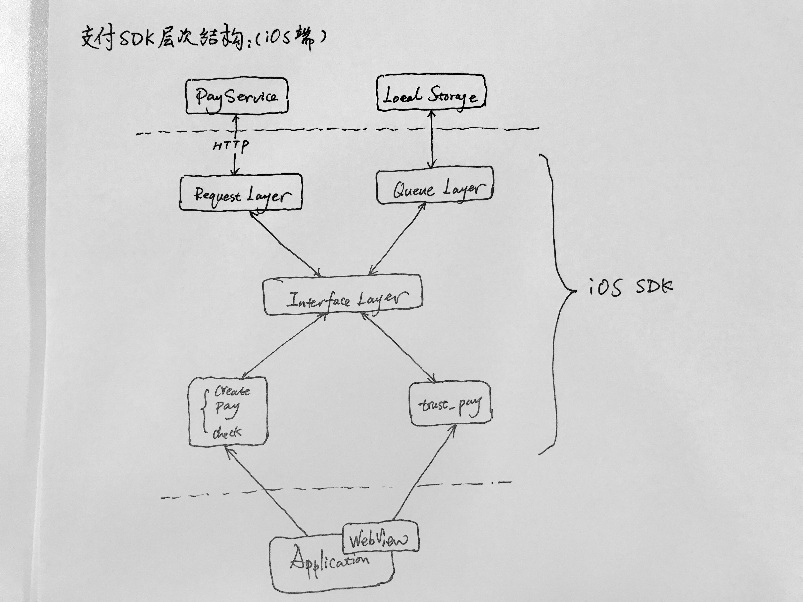
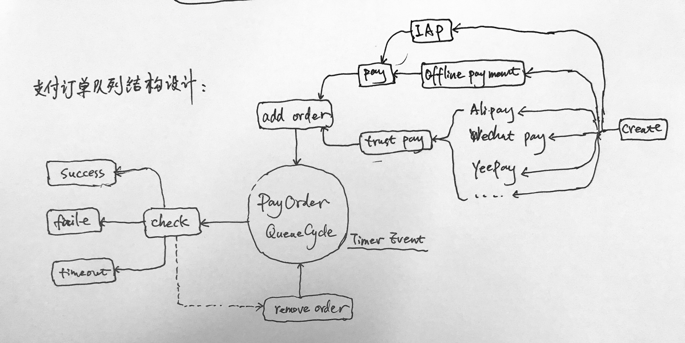

# 全能支付

## 系统结构



## 订单队列



## 安装方法

* 通过CocoaPods安装  

```
pod 'QNPaySDK'
```

* 通过项目安装   

将QNPaySDK项目以及Coastline项目加载到项目中, 并且依赖此. 项目即可支持此功能. 

## 使用方法

在 AppDelegate中, 需要加载QNPaySDK和Coastline

```
import QNPaySDK
import Coastline
```

在程序启动的过程中, 注册队列回调  

```
func application(_ application: UIApplication, didFinishLaunchingWithOptions launchOptions: [UIApplicationLaunchOptionsKey: Any]?) -> Bool {
	let p = QNPay.shareInstance
	/*
	在此配置支付的baseUrl, appKey, appId, userId等信息
	*/
	p.registerQueue { (result, order) in
		let title = (result == .success) ? "完成支付" : (result == .faild ? "支付错误" : "支付延时")
		print(title)
	}
	
	return true
}
```

QNPay可以配置的信息如下:   
 * **closeButton** 可以留空, 配置浏览器界面的关闭按钮
 * **baseUrl** 基础URL地址, 这里指的是PayService的BaseURL, 不是Application的BaseURL
 * **appKey** PayService中注册后得到的AppKey值
 * **appId** PayService中注册后得到的AppId值
 * **originUserId** Application中的用户ID, 在用户登录后, 将自己的ID注册到QNPay中, 这样,  支付的时候, 自动使用本UserId
 * **iapPassword** 固定注册的苹果IAP密码, 各个iOS应用程序, 需要从iTunes Connect上获取. 一般上不需要. 
 * **headers** 预设的HTTP Headers  

支付的过程中, 需要调用如下3个函数(都是QNOrderQueue的实例成员函数)  
### 创建订单/获取支付通道
```
func create(originOrderId:String, content:String, price:Int, payTypes:[String]?, resp:@escaping (QNOrder?, [QNPayType], Error?)->())
```
参数定义如下:   
* **originOrderId** Application中的订单编号
* **content** Application中的商品名称
* **price** Application中商品价格, 以分来计算
* **payTypes** 客户端支持的支付类型, 如果留空, 则表示客户端不评判, 完全由服务端返回可用的支付类型
* **resp** 返回回调, 获取一个Order, 以及支付通道列表

获取支付通道后, 用户选择某一个特定的支付通道.  

### 使用WebView进行支付流程
```
func trustPay(order:QNOrder, payType:String, container:UIViewController) -> Bool
```
参数定义如下:   
* **order** 从create接口中获得的订单信息
* **payType** 用户选择的支付类型
* **container** 界面容器, 由于WebView进行支付流程, 必须基于某个界面之上开启WebView, 所以需要传入容器

### 使用支付接口进行支付流程
```
func pay(order:QNOrder, payType:String, receipt:String?, resp:@escaping (Error?)->())
```
参数定义如下:   
* **order** 从create接口获得的订单信息
* **payType** 用户选择的支付类型
* **resp** 接口回调

### 使用IAP进行支付的流程(基于pay接口二次封装)
```
func payIAP(order:QNOrder, aid:String, payType:String = "iap", container:UIView?, resp:@escaping(Error?)->())
```
参数定义如下:   
* **order** 从create接口获得的订单信息
* **aid** 苹果的productId, 由iTunes Connect设置
* **payType** iap支付类型的名称, 缺省可用
* **container** 容器界面, 由于苹果支付需要等待过程, 为了更好的用户体验, 在container上加上等待
* **resp** 接口回调

## 通知系统

一般情况下, 支付系统会在registerQueue的时候, 注册回调函数, 发生支付失败, 成功, 延时等操作的时候, 可以获得处理.   
也可以自己手动监听如下三个事件:   
* Notification.Name.orderQueueSuccess 订单队列支付成功
* Notification.Name.orderQueueFaild 订单队列支付失败
* Notification.Name.orderQueueTimeout 订单队列支付超时

得到事件监听之后, 通过UserInfo得到订单的详情信息. 
